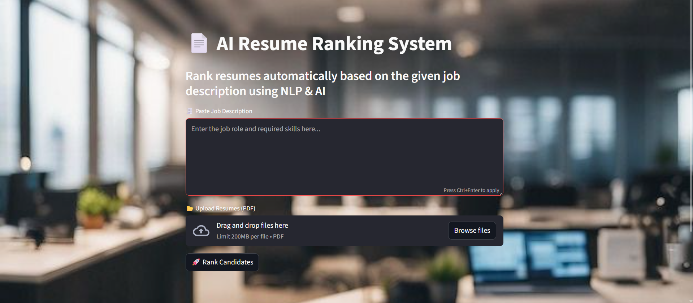
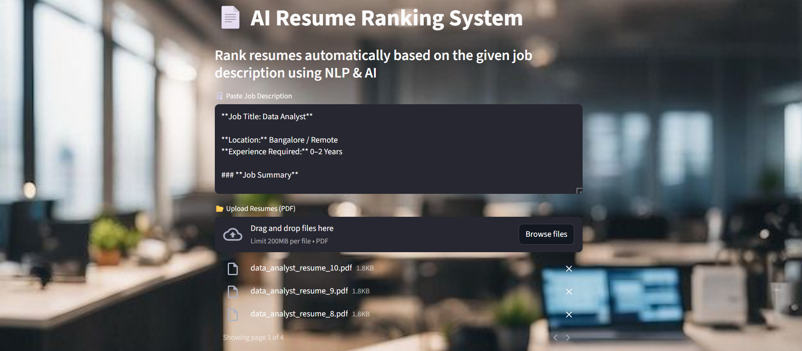
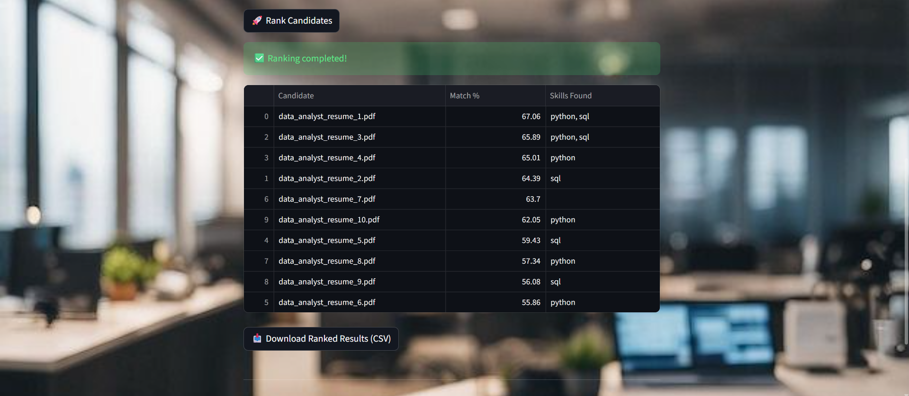

# 🤖 AI Resume Ranking System

An intelligent system that ranks resumes automatically based on a given job description using NLP and AI techniques.

---

## 🚀 Features

* 📄 Upload multiple resumes (PDF)
* 🧠 Extract skills using NLP
* 🎯 Match resumes with job description
* 📊 Rank candidates based on match percentage
* 📥 Download results as CSV
* 🖥 Simple and user-friendly interface

---

## 🛠 Tech Stack

* Python
* NLP (Natural Language Processing)
* Scikit-learn
* Pandas & NumPy
* Streamlit
* PDF Parsing (PyPDF2, pdfplumber)

---

## 📂 Project Structure

```
ai-resume-ranking-system/
│
├── data/
├── sample_resumes/
├── Ranked_CV/
├── screenshots/
│
├── app.py
├── nlp_model.py
├── resume_parser.py
├── requirements.txt
└── README.md
```

---

## 📸 Screenshots

### 🏠 Home Page



### 📝 Job Description Input



### 📊 Ranking Results



### 📊 Ranked CV List(CSV File)

.png)

---

## ⚙️ Installation

1. Clone the repository:

```
git clone https://github.com/MohammedAlthaf-KN/ai-resume-ranking-system.git
cd ai-resume-ranking-system
```

2. Install dependencies:

```
pip install -r requirements.txt
```

3. Run the application:

```
streamlit run app.py
```

---

## 🎯 How It Works

1. Enter a job description
2. Upload resumes (PDF format)
3. System extracts skills using NLP
4. Matches resumes with job requirements
5. Displays ranked candidates with match %

---

## 📌 Example Keywords Used

Python, SQL, Data Analysis, Pandas, NumPy, Power BI, Tableau, Machine Learning, Excel

---

## 💡 Future Improvements

* 🔍 Use advanced models like BERT for better matching
* 🌐 Deploy as a web application
* 📊 Improve scoring algorithm
* 🧾 Support more file formats (DOCX)

---

## 👨‍💻 Author

**Mohammed Althaf K N**
BCA Graduate | Aspiring Data Scientist

---

## ⭐ If you like this project

Give it a ⭐ on GitHub!
=======
\# 🤖 AI Resume Ranking System


An intelligent system that ranks resumes automatically based on a given job description using NLP and AI techniques.


\---


\## 🚀 Features


\* 📄 Upload multiple resumes (PDF)

\* 🧠 Extract skills using NLP

\* 🎯 Match resumes with job description

\* 📊 Rank candidates based on match percentage

\* 📥 Download results as CSV

\* 🖥 Simple and user-friendly interface


\---


\## 🛠 Tech Stack


\* Python

\* NLP (Natural Language Processing)

\* Scikit-learn

\* Pandas \& NumPy

\* Streamlit

\* PDF Parsing (PyPDF2, pdfplumber)


\---


\## 📂 Project Structure


```

ai-resume-ranking-system/

│

├── data/

├── sample\_resumes/

├── Ranked\_CV/

├── screenshots/

│

├── app.py

├── nlp\_model.py

├── resume\_parser.py

├── requirements.txt

└── README.md

```


\---


\## 📸 Screenshots


\### 🏠 Home Page


!\[Home](screenshots/ai-resume-ranking-home.png)


\### 📝 Job Description Input


!\[Input](screenshots/ai-resume-ranking-input.png)


\### 📊 Ranking Results


!\[Results](screenshots/ai-resume-ranking-results.png)


\---


\## ⚙️ Installation


1\. Clone the repository:


```

git clone https://github.com/MohammedAlthaf-KN/ai-resume-ranking-system.git

cd ai-resume-ranking-system

```


2\. Install dependencies:


```

pip install -r requirements.txt

```


3\. Run the application:


```

streamlit run app.py

```


\---


\## 🎯 How It Works


1\. Enter a job description

2\. Upload resumes (PDF format)

3\. System extracts skills using NLP

4\. Matches resumes with job requirements

5\. Displays ranked candidates with match %


\---


\## 📌 Example Keywords Used


Python, SQL, Data Analysis, Pandas, NumPy, Power BI, Tableau, Machine Learning, Excel


\---


\## 💡 Future Improvements


\* 🔍 Use advanced models like BERT for better matching

\* 🌐 Deploy as a web application

\* 📊 Improve scoring algorithm

\* 🧾 Support more file formats (DOCX)


\---


\## 👨‍💻 Author


\*\*Mohammed Althaf K N\*\*

BCA Graduate | Aspiring Data Scientist


\---


\## ⭐ If you like this project


Give it a ⭐ on GitHub!
